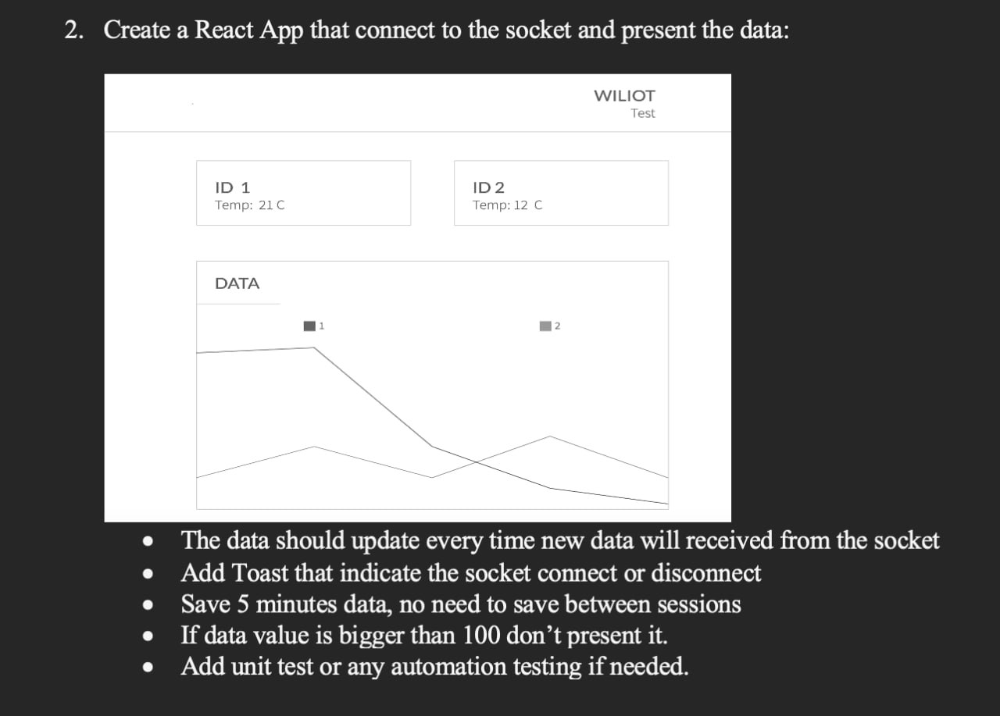

# ast

## Briefing

## DEMO

### TASKS
- [ X ] The data should update every time new data will received from the socket;
- [ X ] Add Toast that indicate the socket connect or disconnect;
- [ 0 ] Save 5 minutes data, no need to save between sessions
- [ X ] If data value is bigger than 100 don't present it;
- [ X ] Add unit test or any automation testing if needed;